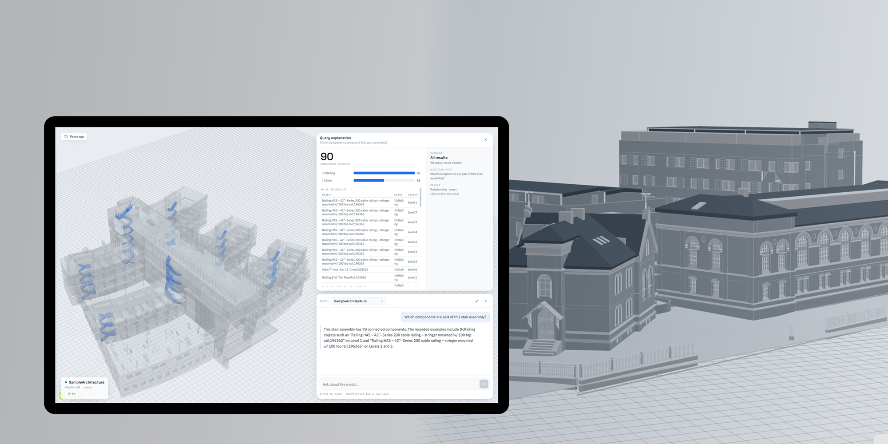

# BIMtrieval

**Ask a building model a question, and see the answer in 3D.**

[](https://github.com/daegeun-kim/BIMtrieval/actions/workflows/ci.yml)
[](LICENSE)

<!-- SCREENSHOTS — drop the five PNGs into docs/images/ and delete this comment
     marker and the closing one below. Framing notes: docs/images/README.md



-->

## The problem

A finished IFC model holds hundreds of thousands of entities. Answering
"how many fire-rated doors are on level 3?" today means opening Revit or
Solibri, building a schedule or a rule set, and knowing the schema well enough
to trust the result. The data is right there; getting at it is a specialist task.

The obvious fix — embed the IFC and ask an LLM — does not work, because BIM
questions are not one shape:

| Question | What it actually is |
| --- | --- |
| "How many doors are on level 3?" | **Relational.** An exact `COUNT` with a spatial join. An approximate answer is a wrong answer. |
| "What spaces does this wall bound?" | **Graph.** Traversal over IFC relationship objects. |
| "Which elements look fire-safety related?" | **Semantic.** No column contains "fire safety". |

Vector search cannot count. SQL cannot infer meaning. BIMtrieval routes each
question to the retrieval method that can actually answer it, then grounds the
response in what was retrieved.

## How it works

```text
 IFC file                PostgreSQL                    FastAPI backend              React + Three.js
┌──────────┐   parse    ┌───────────────────┐         ┌──────────────────┐         ┌────────────────┐
│ .ifc     │──────────► │ entities          │◄────────│  SQL   (exact)   │         │  3D viewer     │
│ 63-170MB │  IfcOpen-  │ relationships     │ READ    │  graph (traverse)│────────►│  chat          │
│          │  Shell     │ rag_documents     │ ONLY    │  RAG   (semantic)│  HTTP   │  floor plans   │
└──────────┘            │ + pgvector (bge-m3)│        │  hybrid          │         │  explanation   │
                        └───────────────────┘         └──────────────────┘         └────────────────┘
   ingestion  ── the only writer ──┘                    binder → execute → grounded answer
```

Three independently managed applications. **PostgreSQL is the only runtime
integration boundary between them**, and the backend connects through a
dedicated read-only role, so a malformed query structurally cannot corrupt the
model corpus.

A question becomes an answer in a fixed, auditable sequence: a **constraint
ledger** decomposes what was asked into typed obligations; an LLM **binds** each
one to a concept in the model's semantic manifest; deterministic validation
refuses the binding if any obligation was silently dropped; the database
executes; and a second LLM call **expresses** the already-computed evidence
without being able to select anything. Every factual claim in the answer is
checked against the retrieved evidence before the user sees it.

That refusal path is the important part. Asked "how many parking spaces are
there?" against a model whose `IfcSpace` entities are not parking, the pipeline
does **not** answer with every space in the building — it says it could not apply
"parking". Confident fabrication about a building is the failure mode this
system is built to prevent.

## Quick start — Docker Compose

The supported way to run BIMtrieval. Requires Docker Desktop (or Docker Engine
with the Compose plugin) and nothing else — no Python, no Node, no PostgreSQL.

```bash
git clone https://github.com/daegeun-kim/BIMtrieval.git
cd BIMtrieval
cp .env.example .env          # then add your own OPENAI_API_KEY
docker compose up --build     # first build takes a few minutes
```

Open **http://localhost:5173**.

That brings up PostgreSQL with pgvector, runs the idempotent schema setup, and
starts the read-only backend and the viewer. The database lives in a named
volume, so it survives restarts.

Importing a model is a separate, explicit step against a local file — put a
`.ifc` in [`ifc/`](ifc/README.md) and run:

```bash
docker compose run --rm import "My Building.ifc"
docker compose run --rm import /app/ifc/other-model.ifc   # or any mounted path
```

```bash
docker compose down           # stop, keeping the database
docker compose down -v        # stop and delete the database volume
```

**Without an OpenAI key**, or before importing anything, the stack still starts
and stays inspectable: the API, catalog, and viewer work, and question answering
reports what is missing instead of fabricating an answer.

Only `127.0.0.1` ports are published, and PostgreSQL is not published at all.

For a long-running instance, add the production overlay — mandatory credentials,
read-only root filesystems, all Linux capabilities dropped, bounded memory and
CPU, dev endpoints off:

```bash
docker compose -f compose.yaml -f compose.prod.yaml up -d --build
```

**There is no hosted demo, deliberately.** A public endpoint would spend the
author's OpenAI tokens on every visitor's query, and the alternative — asking
visitors to paste their own key into a web page — teaches a habit nobody should
have. You run your own instance with your own key, and the key never leaves your
machine. See **[`docs/self-hosting.md`](docs/self-hosting.md)** for the full
procedure, the security posture, and cost expectations.

## Evaluation

Benchmark **v003**: 27 end-to-end cases against a real IFC2X3 model (6,989
entities, 10,462 embedded documents), read-only, scored per case.

| | Result |
| --- | ---: |
| Cases passed | **26 / 27** |
| Exact-answer correctness | 6 / 6 |
| Grounding / hallucination failures | **0** |
| Median latency · tokens per question | 24.6 s · 9,357 |

By route: `sql` 18/19 · `rag` 3/3 · `graph` 1/1 · `clarify` 2/2 ·
`explain_general` 2/2.

The one failure is a semantic question the planner answered with a lexical name
filter — it returned an honest zero rather than a fabrication, and is left
failing rather than tuned away.

**These numbers describe the pipeline as it was measured**, on a `gpt-5-nano`
roster that has since changed, with no baseline comparison arm. Full provenance,
latency distribution, and the limits of what this claims:
**[`evaluation/benchmark_v003.md`](evaluation/benchmark_v003.md)**.

## Three independent applications

The repository is organized as three independently managed top-level projects.
**PostgreSQL is the only runtime integration boundary between them.**

```text
BIMtrieval/
├── ifc/         # put your local IFC models here (git-ignored)
├── ingestion/   # IFC → PostgreSQL structured tables + stored corpus vectors
├── backend/     # FastAPI SQL/RAG/graph/hybrid query service (read-only on BIM data)
├── frontend/    # React/Three.js (That Open Fragments) BIM viewer + chat UI
├── specs/       # authoritative blueprints (spec_v001 … spec_v012)
├── tasks/       # smaller updates/fixes; merged into specs when done
├── docs/        # architecture and evaluation notes
└── scripts/     # local dev helpers
```

- **Ingestion** owns IFC parsing, BIM table creation/migration, source-model
  insertion, relationship materialization, natural-language corpus generation,
  and stored-vector generation. It is the only application that writes BIM data.
- **Backend** reads the already-created PostgreSQL data. It **does not** import
  ingestion code, parse IFC files, create/migrate BIM tables, or generate stored
  corpus vectors. It owns its own read-oriented database models and configuration.
- **Frontend** (`frontend/`) is an independent React/TypeScript/Vite app. It calls
  only the backend HTTP API and never connects to PostgreSQL or OpenAI directly.

The backend must never write BIM corpus data. It connects through a dedicated
read-only PostgreSQL role and enforces statement/result limits.

## Database schema ownership

The five canonical tables and two catalog-metadata tables are **created and
migrated by ingestion**:

```text
ifc_source_models   ifc_entities   ifc_relationships   relationship_members
rag_documents       model_families   source_model_catalog_entries
```

The backend defines its own backend-owned SQLAlchemy models that mirror this live
schema for **read-only** access (`backend/app/db/models.py`). This small
definitional overlap with the ingestion schema is intentional: the two
applications are independent by design.

## Configuration

Copy `.env.example` to `.env` in the repository root and fill in your own values:

```powershell
cp .env.example .env
```

Three names, and the file documents what each is for:

| Name | Used by | Purpose |
| --- | --- | --- |
| `db_url` | ingestion | The **write** account. Creates the schema and imports models. The only connection that ever writes BIM data. |
| `DATABASE_URL` | backend | The dedicated **read-only** role, so the API structurally cannot modify the corpus. Optional — falls back to `db_url`, which gives up that guarantee. |
| `OPENAI_API_KEY` | backend | **Your** key. Never shipped, never proxied, never requested in the browser. |

`.env` is git-ignored. Secrets are never printed, logged, or baked into an image.

## Ingestion — setup and commands (Conda)

Ingestion uses the `bim_rag` Conda environment (Python 3.11, IfcOpenShell,
PyTorch, Sentence Transformers, pgvector, SQLAlchemy).

```powershell
conda activate bim_rag
pip install -e ingestion

# 1. Create the schema. Idempotent — safe to re-run at any time.
bim-db-init                        # add --with-readonly-role on first setup

# 2. Import a model. Also idempotent: content is fingerprinted, so re-running
#    on an unchanged file is recognised rather than duplicated.
bim-import "My Building.ifc"       # a filename in ifc/
bim-import D:\models\tower.ifc     # or any path on disk
```

`bim-db-init` enables pgvector, creates every canonical table, applies pending
SQL migrations (recorded in a `schema_migrations` ledger, so a second machine
reaches the same schema without knowing which scripts to run in which order),
and seeds catalog metadata.

`bim-import` runs the complete workflow: structured import → semantic manifest →
stored vectors. Under it, `ifc_to_db(ifc_path)` in `bim_rag.pipeline_structured`
remains the public library entry point, and
`ingestion/notebooks/ingestion.ipynb` runs the same call with a readiness report.

### Where IFC files go

Put `.ifc` files in **`ifc/`** at the repository root — see [`ifc/README.md`](ifc/README.md).
A bare filename is resolved there; any absolute or relative path also works, so a
170 MB model never has to be copied to be ingested. Set `ifc_dir` in `.env` to
point somewhere else entirely.

Building models are large and usually licensed, so `ifc/*.ifc` is git-ignored and
none are redistributed here. The automated tests do not need one: they use the
1.6 KB `frontend/tests/fixtures/smoke-wall.ifc` fixture.

There is deliberately **no browser or API upload**. Ingestion is a local
operation against a local file path.

## Backend — setup and commands (pyenv-win + Poetry)

The backend is a Poetry **application project** (`package-mode = false`) on
pyenv-win Python 3.11.

```powershell
cd backend
# Python 3.11 is pinned via backend/.python-version (pyenv-win)
poetry install                    # API + tests. No torch: fast, works anywhere.
poetry install --with embedding   # adds semantic (RAG) retrieval — large, CUDA-pinned

# Authoritative dev command (run from backend/):
poetry run uvicorn app.main:app --reload
```

The `embedding` group is optional on purpose. Semantic retrieval embeds the
question with the same model the stored corpus used (BAAI/bge-m3), which pulls
in a multi-gigabyte, hardware-specific torch build. Without it the backend still
starts and answers SQL and graph questions; the RAG path reports a degraded mode
rather than failing. See the comment in `backend/pyproject.toml` for the CPU
alternative.

`app.main:app` is the FastAPI application. Public contract: `POST /api/query`
plus `/health` and `/ready`. The backend has **no** dependency on the ingestion
project or the `bim_rag` package.

> Optional: it can also be started from the repository root, but the `backend/`
> command above is authoritative.

## Frontend — setup and commands (npm)

```powershell
cd frontend
npm install
npm run dev            # http://localhost:5173 (expects the backend at :8000)
```

See `frontend/README.md` for build/test/lint scripts and preparing a viewer artifact.

## Optional: Windows dev launcher

Secondary to Docker Compose, and only useful once you have already done the
manual setup above. It starts the backend and frontend dev servers in two
visible terminals, waits for both to become ready, and opens the app once:

```powershell
powershell -ExecutionPolicy Bypass -File .\scripts\start-dev.ps1
powershell -ExecutionPolicy Bypass -File .\scripts\stop-dev.ps1
```

It installs nothing and reuses anything already running. `stop-dev.ps1` stops
only the processes the launcher itself started, verified by process identity, so
a server you started by hand is left alone.

> The previous entry point, a committed `Start BIM RAG.lnk` Windows shortcut,
> was removed. It stored an absolute path, worked on exactly one operating
> system, and was a binary in version control. Use Docker Compose.

**Troubleshooting:**

- *"Port already in use by another application"* — something else is bound to
  `:8000` or `:5173`. The launcher will not touch it; free the port yourself.
- *Backend terminal shows a database error* — the frontend still opens in a
  degraded state; check `.env` and that PostgreSQL is reachable.
- Launcher process bookkeeping lives in the git-ignored `.runtime/` — safe to
  delete; the launcher re-verifies process identity on every run.

## What this is and is not

Stated plainly, because a portfolio project that oversells itself is worth less
than one that is honest about its edges.

**It is** a working, containerised, CI-gated prototype that answers real
questions about real IFC models, with published evaluation numbers and a
grounding contract that refuses rather than guesses.

**It is not:**

- **Fast.** A median question takes ~25 s, essentially all of it model
  reasoning — database execution is ~0.4 s. This is not yet interactive.
- **Multi-user.** No authentication, no tenancy, no rate limiting. It is a
  single-user local tool, and `POST /api/query` costs money to call, so do not
  expose it. See [`docs/self-hosting.md`](docs/self-hosting.md).
- **Benchmarked against a baseline.** 26/27 shows the pipeline works. There is
  no vector-only or SQL-only arm, so it does **not** show hybrid retrieval beats
  a simpler approach. That is the most valuable missing measurement.
- **Broadly validated.** The published run used one IFC2X3 model with no quantity
  sets. Cross-model comparison and numeric aggregates over IFC quantities are
  handled honestly but are not measured.
- **Geometry-aware.** Clash detection, spatial reasoning, and PostGIS geometry
  are out of scope. Queries run over entities, relationships, and properties.
- **A design authoring tool.** It reads models. It never writes them — by
  construction, through a read-only database role.

### Cost

You pay OpenAI directly, per question, with your own key. From the published
benchmark a question used a median of ~9,400 tokens and a maximum of ~31,000,
dominated by the semantic manifest sent to the binder. Rates change, so multiply
by current pricing rather than trusting a figure here.

Idle cost is zero. Startup, loading a model, orbiting the viewer, switching
floors, and browsing evidence make **no** model calls at all.

### Security boundary

- The backend connects through a dedicated **read-only** PostgreSQL role and
  enforces statement and result limits.
- The frontend never contacts OpenAI, never sees your key, and never asks for
  one. Only the backend calls the API.
- Your IFC files stay on your disk, git-ignored, and are mounted **read-only**
  into the import container.
- Nothing but the question text and retrieved evidence leaves your machine.

## Testing

Every project separates a **fast offline gate** from checks that need a
database, an embedding model, a browser, or a network. The offline gate is the
default command and requires no `.env`, no PostgreSQL, and no `OPENAI_API_KEY`.

### Fast offline gate

```powershell
# Ingestion (from ingestion/, Conda bim_rag env)
pytest
ruff check .
ruff format --check .

# Backend (from backend/, Poetry env)
poetry run pytest
poetry run ruff check .
poetry run ruff format --check .

# Frontend (from frontend/)
npm test
npm run typecheck
npm run lint
npm run build
```

### Separately named checks (never run by the default gate)

```powershell
# Backend: live read-only PostgreSQL (+ the local embedding model for RAG cases).
# Deselected by default via the `live` marker; skips green if the DB is absent.
cd backend;    poetry run pytest -m live

# Ingestion: manifest generation against the real imported models.
# Lives in its own tests_live/ root, so `pytest` never collects it.
cd ingestion;  pytest tests_live

# Frontend: critical-path browser suite (Chromium; stubs the backend entirely).
cd frontend;   npx playwright install chromium   # once
               npx playwright test
```

No test in any of these suites calls OpenAI. LLM behaviour is always injected or
faked, so a full run costs nothing and cannot be rate-limited. The live
benchmark that does spend tokens is an explicit owner-run command, never a test.

### Continuous integration

`.github/workflows/ci.yml` runs the offline gate for all three projects, plus
the Playwright critical path, on every pull request and every push to `main`.

It is secret-free by construction — no `.env`, no `OPENAI_API_KEY`, no database,
no downloaded embedding model — which is exactly why the live suites above are
not part of it. Superseded runs are cancelled, and the Poetry virtualenv and npm
cache are keyed on their lock files.

## When something goes wrong

| Symptom | Cause and fix |
| --- | --- |
| `docker compose up` exits on the `setup` service | The database was not ready or `db_url` is wrong. `docker compose logs setup` names the failure; credentials are sanitized out of it. |
| Backend starts, `/ready` reports the database is down | `/health` (the app) and `/ready` (the database) are separate on purpose. Check `docker compose ps db` and that pgvector is installed. |
| "No models available" in the UI | Nothing has been imported. Run `docker compose run --rm import "<file>.ifc"`. |
| Answers say no API key is configured | `OPENAI_API_KEY` is missing from `.env`. Not a crash — the viewer and catalog still work. |
| `bim-import` cannot find your file | It reports both places it looked. Put the file in `ifc/`, or pass a full path. |
| `bim-db-init` reports a changed migration | An applied `.sql` file was edited. Add a new numbered migration instead of editing an applied one. |
| 3D model does not render | No prepared viewer artifact. The viewer degrades rather than failing; see `frontend/README.md`. |
| Port 8000 or 5173 already in use | Something else is bound to it. Free the port; nothing here will take it from another process. |

Reset everything, including the database:

```bash
docker compose down -v
```

## Documentation

| Document | What it covers |
| --- | --- |
| [`evaluation/`](evaluation/) | The benchmark: cases, results, report, budgets, reproduction |
| [`docs/self-hosting.md`](docs/self-hosting.md) | Running your own instance, security posture, backup, cost |
| [`specs/`](specs/) | Twelve numbered blueprints — the design record, readable without the code |
| [`docs/architecture_v004.md`](docs/architecture_v004.md) | RAG path, including the similarity-threshold calibration |
| [`ifc/README.md`](ifc/README.md) | Where local IFC models go, and why there is no upload button |
| [`AGENTS.md`](AGENTS.md) | Canonical instructions for AI assistants working in this repository |

## License

MIT — see [`LICENSE`](LICENSE). No IFC model is redistributed here; each
referenced sample belongs to its own source.
